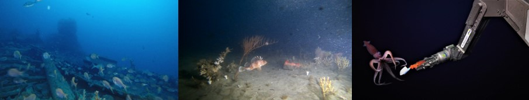

[Jacquomo Monk](mailto:jacquomo.monk@utas.edu.au)

Chapter citation:
Monk J, 2019. ROV. In Field Manuals for Marine Sampling to Monitor Australian Waters, Przeslawski R, Foster S (Eds). National Environmental Science Programme (NESP). 
