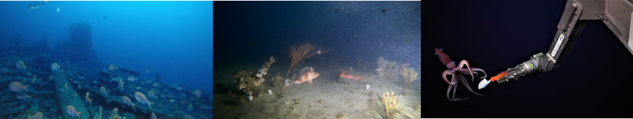

<a href="mailto:jacquomo.monk@utas.edu.au">Jacquomo Monk</a>, Neville Barrett, Todd Bond, Ashley Fowler, Dianne McLean, Julian Partridge, Nicholas Perkins, Rachel Przeslawski, Paul G Thomson & Joel Williams

 

 
 
<strong>Chapter citation:</strong> Monk J, Barrett N, Bond T, Fowler A, McLean D, Partridge J, Perkins N, Przeslawski R, Thomson P.G, Williams J. 2020. Field manual for imagery based surveys using remotely operated vehicles (ROVs). In <em>Field Manuals for Marine Sampling to Monitor Australian Waters, Version 2</em>. Przeslawski R, Foster S (Eds). National Environmental Science Programme (NESP)..

| Chapter Contents                                                                                                           |
|----------------------------------------------------------------------------------------------------------------------------|
|  **[Platform Description](https://rov-field-manual.github.io/platform-description)**                             | 
|  **[Scope](https://rov-field-manual.github.io/scope)**                                                           |   
|  **[ROVs in Marine Monitoring](https://rov-field-manual.github.io/rovs-in-marine-monitoring)** |
|  **[Pre-survey Preparations](https://rov-field-manual.github.io/pre-survey-preparations)**                       |
|  **[Field Procedures](https://rov-field-manual.github.io/field-procedures)**                                     |  
|       _[Onboard sample acquisition](https://rov-field-manual.github.io/field-procedures#onboard-sample-acquisition)_                         |
|       _[Onboard data processing and storage](https://rov-field-manual.github.io/field-procedures#onboard-data-processing-and-storage)_                   |
|  **[Post-survey Procedures](https://rov-field-manual.github.io/post-survey-procedures)**                         | 
|       _[Processing and annotation of video footage](https://rov-field-manual.github.io/post-survey-procedures#processing-and-annotation-of-video-footage)_             |
|       _[Processing and annotation of downward facing still imagery](https://rov-field-manual.github.io/post-survey-procedures#processing-and-annotation-of-downward-facing-still-imagery)_             |
|       _[Data curation and quality control](https://rov-field-manual.github.io/post-survey-procedures#data-curation-and-quality-control)_           |
|       _[Data release](https://rov-field-manual.github.io/post-survey-procedures#data-release)_                   |
|       _[Data analysis](https://rov-field-manual.github.io/post-survey-procedures#data-analysis)_                   |
|  **[Field Manual Maintenance](https://rov-field-manual.github.io/field-manual-maintenance)**                     |  
|  **[Acknowledgements](https://rov-field-manual.github.io/acknowledgements)**                                     | 
|  **[References](https://rov-field-manual.github.io/references)**                                                 |                                 

<a href="#" class="scrollUpButton">Back to top</a>
